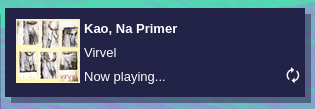

# Last.fm Now Playing

a html widget that shows the currently playing or last played song for a Last.fm user, along with the album art and refresh button



## Installation
just edit the `username` variable in the beginning of `main.js` and it should work.

## Usage
i recommend using it as an `iframe` element.

```
<div id="player">
    <iframe id="player-frame" src="lastfm-now-playing/index.html" frameborder="0" scrolling="no">
    </iframe>
</div>
```

everything but the font style and color are handled on the `iframe` element side.
